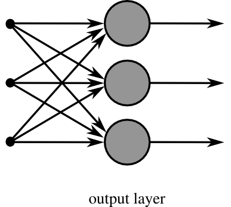

# 神經網路
## 構成
典型的人工神經網路具有以下三個部分：

1. 結構（Architecture）結構指定了網路中的變數和它們的拓撲關係。例如，神經網路中的變數可以是神經元連接的權重（weights）和神經元的激勵值（activities of the neurons）。
2. 激勵函式（Activation Rule）大部分神經網路模型具有一個短時間尺度的動力學規則，來定義神經元如何根據其他神經元的活動來改變自己的激勵值。一般激勵函式依賴於網路中的權重（即該網路的參數）。
3. 學習規則（Learning Rule）學習規則指定了網路中的權重如何隨著時間推進而調整。這一般被看做是一種長時間尺度的動力學規則。一般情況下，學習規則依賴於神經元的激勵值。它也可能依賴於監督者提供的目標值和當前權重的值。例如，用於手寫辨識的一個神經網路，有一組輸入神經元。輸入神經元會被輸入圖像的資料所激發。在激勵值被加權並通過一個函式（由網路的設計者確定）後，這些神經元的激勵值被傳遞到其他神經元。這個過程不斷重複，直到輸出神經元被激發。最後，輸出神經元的激勵值決定了辨識出來的是哪個字母。
## 單一神經元

* a1~an為輸入向量的各個分量
* w1~wn為神經元各個突觸的權值
* b為偏置
* f為傳遞函式，通常為非線性函式。一般有traingd(),tansig(),hardlim()。以下預設為hardlim()
* t為神經元輸出
## 神經元網路
* 單層
* 整體架構
    * 輸入層（Input layer），眾多神經元（Neuron）接受大量非線形輸入訊息。輸入的訊息稱為輸入向量。
    * 輸出層（Output layer），訊息在神經元鏈接中傳輸、分析、權衡，形成輸出結果。輸出的訊息稱為輸出向量。
    * 隱藏層（Hidden layer），簡稱「隱層」，是輸入層和輸出層之間眾多神經元和鏈接組成的各個層面。隱層可以有一層或多層。隱層的節點（神經元）數目不定，但數目越多神經網路的非線性越顯著，從而神經網路的強健性（robustness）（控制系統在一定結構、大小等的參數攝動下，維持某些效能的特性）更顯著。習慣上會選輸入節點1.2至1.5倍的節點。
### [x^2+y^2+z^2 實作](https://github.com/peter8995/ai108b/tree/master/x%5E2%2By%5E2%2Bz%5E2)
### [梯度下降法](https://misavo.com/blog/%E9%99%B3%E9%8D%BE%E8%AA%A0/%E6%9B%B8%E7%B1%8D/%E4%BA%BA%E5%B7%A5%E6%99%BA%E6%85%A7/03-%E7%A5%9E%E7%B6%93%E7%B6%B2%E8%B7%AF/B-%E6%A2%AF%E5%BA%A6%E4%B8%8B%E9%99%8D%E6%B3%95)
### [反傳遞演算法](https://misavo.com/blog/%E9%99%B3%E9%8D%BE%E8%AA%A0/%E6%9B%B8%E7%B1%8D/%E4%BA%BA%E5%B7%A5%E6%99%BA%E6%85%A7/03-%E7%A5%9E%E7%B6%93%E7%B6%B2%E8%B7%AF/C-%E5%8F%8D%E5%82%B3%E9%81%9E%E7%AE%97%E6%B3%95)
## [參考資料](https://zh.wikipedia.org/wiki/%E4%BA%BA%E5%B7%A5%E7%A5%9E%E7%BB%8F%E7%BD%91%E7%BB%9C#%E5%8D%95%E5%B1%82%E7%A5%9E%E7%BB%8F%E5%85%83%E7%BD%91%E7%BB%9C)
## [延伸影片](https://www.youtube.com/watch?v=ILsA4nyG7I0)