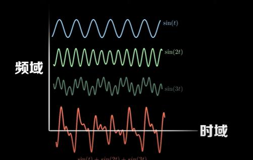
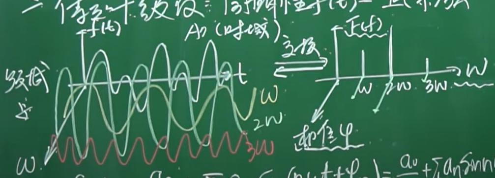
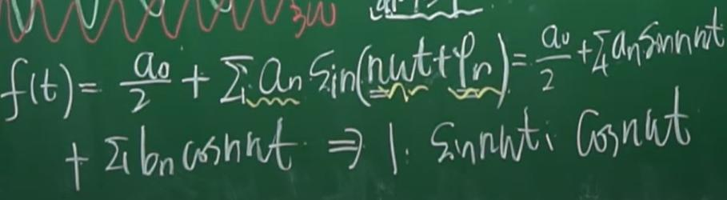
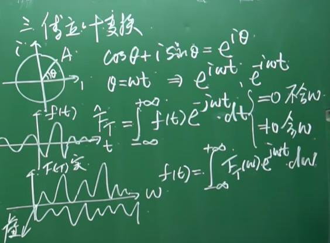
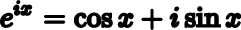

# 科學計算
欄位 | 內容
-----|--------
教學網站 | [科學計算](https://misavo.com/blog/%E9%99%B3%E9%8D%BE%E8%AA%A0/%E6%9B%B8%E7%B1%8D/%E7%A7%91%E5%AD%B8%E8%A8%88%E7%AE%97)

## 傅立葉
[參考影片](https://www.youtube.com/watch?v=0LuyxzqI3Hk)

* 傅立葉級數    
把一個週期性函數分成一系列的正弦函數
* 傅立葉變換    
把頻域抓出來，加上相位(起始點)成為另一張圖

* 傅立葉函數

n:整數 omega:頻率 phi:相位角 a0:震幅
* 連續傅立葉變換

[參考wiki](https://zh.wikipedia.org/wiki/%E8%BF%9E%E7%BB%AD%E5%82%85%E9%87%8C%E5%8F%B6%E5%8F%98%E6%8D%A2)
* 歐拉恆等式
是連續傅立葉變換的基礎

### 實作
* [diffn](https://github.com/peter8995/ai108b/tree/master/diffn)
* [使用sympy解RC電路微分方程](https://github.com/peter8995/ai108b/tree/master/rcCircuitDsolve)
* [拓展到複數上的root.py](https://github.com/peter8995/ai108b/tree/master/root)
