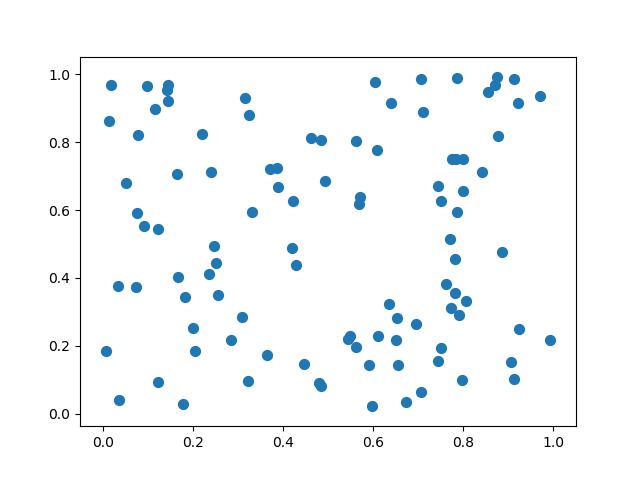
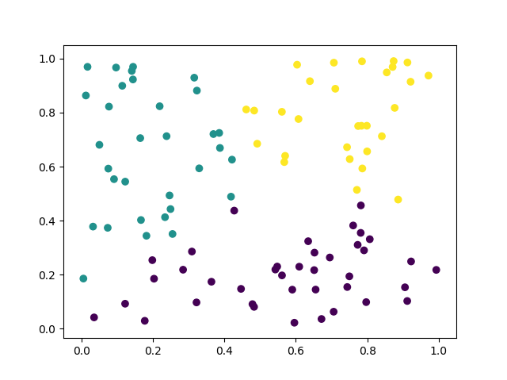
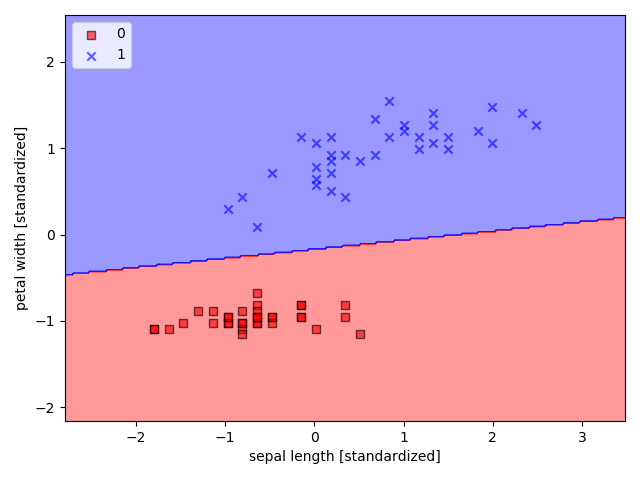

# 模式識別
## knn演算法
```
# 來源 -- https://ithelp.ithome.com.tw/articles/10197110
from sklearn import datasets
from sklearn.model_selection import train_test_split
from sklearn.neighbors import KNeighborsClassifier
import numpy as np

iris = datasets.load_iris()

iris_data = iris.data
iris_label = iris.target

train_data , test_data , train_label , test_label = train_test_split(iris_data,iris_label,test_size=0.2)

knn = KNeighborsClassifier() # n_neighbors=5
# knn = KNeighborsClassifier(n_neighbors=1)
# knn = KNeighborsClassifier(n_neighbors=3)
# knn = KNeighborsClassifier(n_neighbors=37)

knn.fit(train_data,train_label)

print('預測答案：', knn.predict(test_data))
print('正確答案：', test_label)
```
結果
```
PS D:\codes\ai2\python\09-patternRecognition\classify> python knn.py
預測答案： [1 1 2 2 1 1 0 2 1 0 1 2 0 2 0 2 0 1 2 1 2 0 1 2 1 2 2 2 0 1]
正確答案： [1 1 2 2 1 1 0 2 1 0 1 2 0 2 0 2 0 1 2 1 2 0 1 2 1 1 2 1 0 1]
```
## kmean自動分類
```
# 來源 -- https://dotblogs.com.tw/kevinya/2018/06/15/105548
# 進行數據分析之前常要引用的函式庫
import numpy as np
import matplotlib.pyplot as plt

# 產生100筆資料，每筆資料都是2個數字
X = np.random.rand(100,2)

#畫出來看看，想當然是平均的佈滿整個畫面
#然後我們會用KMeans硬把他分類(明明沒意義的100個點……但他就是分的出來)
plt.scatter(X[:,0],X[:,1],s=50)
plt.show()

#接下來匯入KMeans函式庫
from sklearn.cluster import KMeans

#請KMeans分成三類
clf = KMeans(n_clusters=3)

#開始訓練！
clf.fit(X)

# 這樣就可以取得預測結果了！
clf.labels_

# 最後畫出來看看
# 真的分成三類！太神奇了………無意義的資料也能分～
plt.scatter(X[:,0],X[:,1], c=clf.labels_)
# KMeans的使用時機就在於～你根本不知道測試的資料有什麼特性的時候
# 就是用他的時候了，我稱KMeans為盲劍客 XD
plt.show()

```
* 結果



## svm演算法
[參考資料](https://medium.com/jameslearningnote/%E8%B3%87%E6%96%99%E5%88%86%E6%9E%90-%E6%A9%9F%E5%99%A8%E5%AD%B8%E7%BF%92-%E7%AC%AC3-4%E8%AC%9B-%E6%94%AF%E6%8F%B4%E5%90%91%E9%87%8F%E6%A9%9F-support-vector-machine-%E4%BB%8B%E7%B4%B9-9c6c6925856b)
* svm.py
```
# 來源 -- https://medium.com/jameslearningnote/%E8%B3%87%E6%96%99%E5%88%86%E6%9E%90-%E6%A9%9F%E5%99%A8%E5%AD%B8%E7%BF%92-%E7%AC%AC3-4%E8%AC%9B-%E6%94%AF%E6%8F%B4%E5%90%91%E9%87%8F%E6%A9%9F-support-vector-machine-%E4%BB%8B%E7%B4%B9-9c6c6925856b
from sklearn import datasets
import pandas as pd
import numpy as np
import matplotlib.pyplot as plt
import seaborn as sns
from sklearn.model_selection import train_test_split
from sklearn.preprocessing import StandardScaler
from sklearn.svm import SVC
from matplotlib.colors import ListedColormap

iris = datasets.load_iris()
x = pd.DataFrame(iris['data'], columns=iris['feature_names'])
print("target_names: "+str(iris['target_names']))
y = pd.DataFrame(iris['target'], columns=['target'])
iris_data = pd.concat([x,y], axis=1)
iris_data = iris_data[['sepal length (cm)','petal length (cm)','target']]
iris_data = iris_data[iris_data['target'].isin([0,1])]
print(iris_data.head(3))

X_train, X_test, y_train, y_test = train_test_split(
    iris_data[['sepal length (cm)','petal length (cm)']], iris_data[['target']], test_size=0.3, random_state=0)

sc = StandardScaler()
sc.fit(X_train)
X_train_std = sc.transform(X_train)
X_test_std = sc.transform(X_test)

svm = SVC(kernel='linear', probability=True)

svm.fit(X_train_std,y_train['target'].values)

print('predict:', svm.predict(X_test_std))
print('answer :', y_test['target'].values)

error = 0
for i, v in enumerate(svm.predict(X_test_std)):
    if v!= y_test['target'].values[i]:
        error+=1
print(error)

print(svm.predict_proba(X_test_std))


def plot_decision_regions(X, y, classifier, test_idx=None, resolution=0.02):

    # setup marker generator and color map
    markers = ('s', 'x', 'o', '^', 'v')
    colors = ('red', 'blue', 'lightgreen', 'gray', 'cyan')
    cmap = ListedColormap(colors[:len(np.unique(y))])

    # plot the decision surface
    x1_min, x1_max = X[:, 0].min() - 1, X[:, 0].max() + 1
    x2_min, x2_max = X[:, 1].min() - 1, X[:, 1].max() + 1
    xx1, xx2 = np.meshgrid(np.arange(x1_min, x1_max, resolution),
                           np.arange(x2_min, x2_max, resolution))
    Z = classifier.predict(np.array([xx1.ravel(), xx2.ravel()]).T)
    Z = Z.reshape(xx1.shape)
    plt.contourf(xx1, xx2, Z, alpha=0.4, cmap=cmap)
    plt.xlim(xx1.min(), xx1.max())
    plt.ylim(xx2.min(), xx2.max())

    for idx, cl in enumerate(np.unique(y)):
        plt.scatter(x=X[y == cl, 0], 
                    y=X[y == cl, 1],
                    alpha=0.6, 
                    c=cmap(idx),
                    edgecolor='black',
                    marker=markers[idx], 
                    label=cl)

    # highlight test samples
    if test_idx:
        # plot all samples
        if not versiontuple(np.__version__) >= versiontuple('1.9.0'):
            X_test, y_test = X[list(test_idx), :], y[list(test_idx)]
            warnings.warn('Please update to NumPy 1.9.0 or newer')
        else:
            X_test, y_test = X[test_idx, :], y[test_idx]

        plt.scatter(X_test[:, 0],
                    X_test[:, 1],
                    c='',
                    alpha=1.0,
                    edgecolor='black',
                    linewidths=1,
                    marker='o',
                    s=55, label='test set')

plot_decision_regions(X_train_std, y_train['target'].values, classifier=svm)
plt.xlabel('sepal length [standardized]')
plt.ylabel('petal width [standardized]')
plt.legend(loc='upper left')
plt.tight_layout()
plt.show()
```
結果


### [程式碼參考來源](https://github.com/ccccourse/ai/tree/master/python/09-patternRecognition)