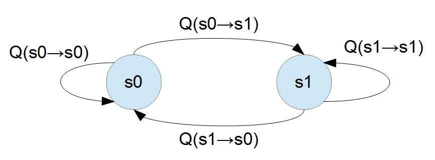
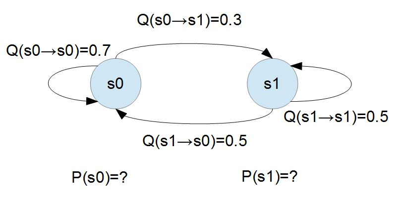

# 機器學習
## 蒙地卡羅方法
通常蒙地卡羅方法可以粗略地分成兩類：
1. 所求解的問題本身具有內在的隨機性，藉助電腦的運算能力可以直接類比這種隨機的過程。     
例如在核物理研究中，分析中子在反應爐中的傳輸過程。中子與原子核作用受到量子力學規律的制約，人們只能知道它們相互作用發生的機率，卻無法準確獲得中子與原子核作用時的位置以及裂變產生的新中子的行進速率和方向。科學家依據其機率進行隨機抽樣得到裂變位置、速度和方向，這樣類比大量中子的行為後，經過統計就能獲得中子傳輸的範圍，作為反應爐設計的依據。
2. 所求解問題可以轉化為某種隨機分布的特徵數，比如隨機事件出現的機率，或者隨機變數的期望值。通過隨機抽樣的方法，以隨機事件出現的頻率估計其機率，或者以抽樣的數字特徵估算隨機變數的數字特徵，並將其作為問題的解。這種方法多用於求解複雜的多維積分問題。   
假設我們要計算一個不規則圖形的面積，那麼圖形的不規則程度和分析性計算（比如，積分）的複雜程度是成正比的。蒙地卡羅方法基於這樣的想法：假設你有一袋豆子，把豆子均勻地朝這個圖形上撒，然後數這個圖形之中有多少顆豆子，這個豆子的數目就是圖形的面積。當你的豆子越小，撒的越多的時候，結果就越精確。藉助電腦程式可以生成大量均勻分布坐標點，然後統計出圖形內的點數，通過它們占總點數的比例和坐標點生成範圍的面積就可以求出圖形面積。
## 馬可夫鏈
* 具有狀態的隨機過程
* 從目前狀態轉移 s 到下一個狀態 s' 的機率」由Q(s → s')所表示，狀態之轉移機率並不會受到狀態以外的因素所影響，因此與時間無關，
* 隨機漫步就是馬可夫鏈的例子。隨機漫步中每一步的狀態是在圖形中的點，每一步可以移動到任何一個相鄰的點，在這裡移動到每一個點的概率都是相同的(無論之前漫步路徑是如何的)。
* 只有兩個狀態的馬可夫系統

### 馬可夫鏈的一般平衡

將 P(s0) 寫為 P0，P(s1) 寫為 P1，則有下列情況
```
P0*0.3 = P1*0.5 ; P0 的流出量 = P0 的流入量
P0+P1 = 1       ; 狀態不是 s0 就是 s1
```
也就會得到 (P0=5/8, P1=3/8)，此時系統達到一般平衡
### 馬可夫鏈的細緻平衡
* 在上述兩個狀態的馬可夫系統中，對於 s0 與 s1 之間的兩條連線，s0 → s1 與s1 → s0 而言，其實已經達到了所謂細緻均衡的條件，因為    
P(s0) * Q(s0→s1) = 5/8 * 0.3 = 15/80 = 3/8 * 0.5 = P(s1) * Q(s1→s0)
* 一個「馬可夫系統」裏的每條線都能達成這樣的平衡，那麼整個系統顯然也是處於一個穩定狀態。這種架構在「線平衡」上的均衡條件，稱為「細致平衡條件」，以下是「細致平衡條件」的數學方程式。    
P(x)Q(x→y)=p(y)Q(y→x)
* 「細致平衡條件」是比「一般平衡」更進一步，要求更多的條件，因此若能達到「細致平衡」，則必然已經達到了「一般平衡」狀態。
* 「[Gibbs 演算法](https://misavo.com/blog/%E9%99%B3%E9%8D%BE%E8%AA%A0/%E6%9B%B8%E7%B1%8D/%E4%BA%BA%E5%B7%A5%E6%99%BA%E6%85%A7/10-%E6%A9%9F%E5%99%A8%E5%AD%B8%E7%BF%92/B2a-Gibbs%E7%AE%97%E6%B3%95)」是在「已知轉移矩陣」時可用來「求解各個節點的機率」
* 「[Metropolis-Hasting 演算法](https://misavo.com/blog/%E9%99%B3%E9%8D%BE%E8%AA%A0/%E6%9B%B8%E7%B1%8D/%E4%BA%BA%E5%B7%A5%E6%99%BA%E6%85%A7/10-%E6%A9%9F%E5%99%A8%E5%AD%B8%E7%BF%92/B2b-Metropolis-Hasting%E7%AE%97%E6%B3%95)」是在知道每個狀態的機率 P(x)，卻不知道「轉移矩陣」的機率值時使用
## 隱馬可夫模型
在正常的馬可夫模型中，狀態對於觀察者來說是直接可見的。這樣狀態的轉換機率便是全部的參數。而在隱藏式馬可夫模型中，狀態並不是直接可見的，但受狀態影響的某些變數則是可見的。每一個狀態在可能輸出的符號上都有一機率分布。因此輸出符號的序列能夠透露出狀態序列的一些資訊。
### 隱馬可夫的三個典型問題
1. 預測預測(filter)：已知模型參數和某一特定輸出序列，求最後時刻各個隱含狀態的機率分布，即求P(x(t)|y(1),...,y(t))通常使用前向演算法解決.
2. 平滑(smoothing)：已知模型參數和某一特定輸出序列，求中間時刻各個隱含狀態的機率分布，即求P(x(k)|y(1),...,y(t)),k<t 通常使用前向-後向演算法解決.
3. 解碼(most likely explanation): 已知模型參數，尋找最可能的能產生某一特定輸出序列的隱含狀態的序列. 即求P([x(1),...,x(t)]|[y(1),...,y(t)])，通常使用Viterbi演算法解決
## EM演算法
最大期望演算法（Expectation-maximization algorithm）在統計中被用於尋找，依賴於不可觀察的隱性變量的概率模型中，參數的最大似然估計。  

EM演算法的兩步驟
1. 初始化分布參數
2. 重複直到收斂：   
E步驟：根據參數的假設值，給出未知變量的期望估計，應用於缺失值。
M步驟：根據未知變量的估計值，給出當前的參數的極大似然估計。
## 參考資料
https://zh.wikipedia.org/wiki/%E9%9A%90%E9%A9%AC%E5%B0%94%E5%8F%AF%E5%A4%AB%E6%A8%A1%E5%9E%8B   
https://zh.wikipedia.org/wiki/%E6%9C%80%E5%A4%A7%E6%9C%9F%E6%9C%9B%E7%AE%97%E6%B3%95
https://misavo.com/blog/%E9%99%B3%E9%8D%BE%E8%AA%A0/%E6%9B%B8%E7%B1%8D/%E4%BA%BA%E5%B7%A5%E6%99%BA%E6%85%A7/10-%E6%A9%9F%E5%99%A8%E5%AD%B8%E7%BF%92