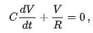

# code
```
import sympy

V = sympy.Function('V')
C, R, t = sympy.symbols('C R t')

#C * V(t).diff(t) + V/R = x
x = C * V(t).diff(t) + V(t)/R

print(sympy.dsolve(x, V(t)))
```

# 想法
* 把下面方程式丟進dsolve函式裡面

* 就會得到要的答案

# 結果
```
PS D:\codes\ai108b\rcCircuitDsolve> python .\rcCircuitDsolve.py
Eq(V(t), exp((C1 - t/R)/C))
```

# 參考資料
http://keejko.blogspot.com/2018/11/python-sympy.html
https://blog.gtwang.org/useful-tools/sympy-python-library-for-symbolic-mathematics/2/